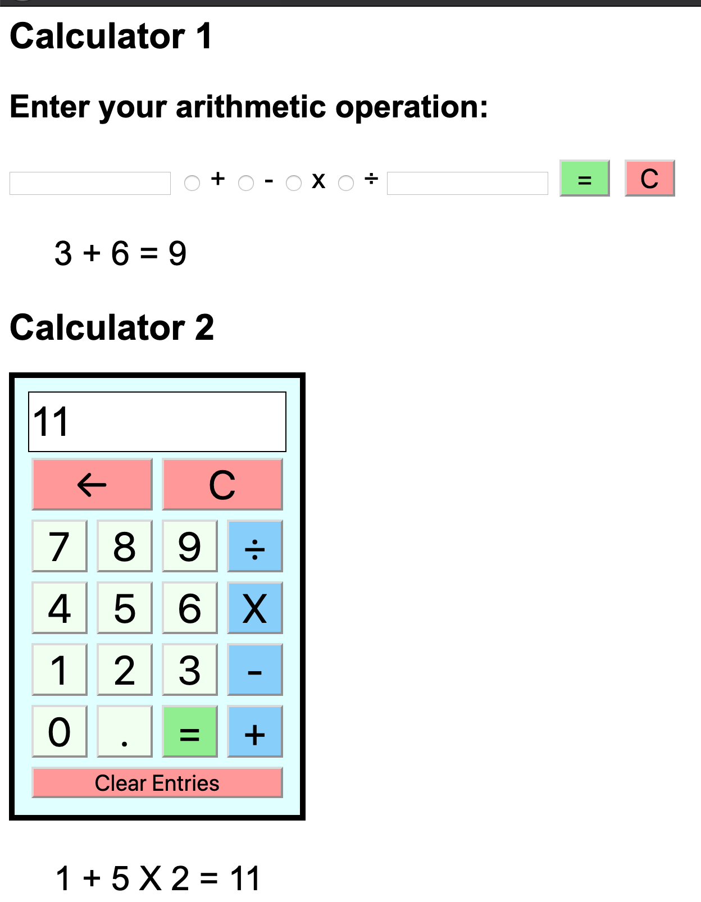

# jQuery Server Side Calculator

[Project Instructions](./INSTRUCTIONS.md), this line may be removed once you have updated the README.md

## Description

Duration: 48 hours - evening 10/2/2020 - evening 10/4/2020

This project is a calculator that does the calculations on the server and sends back the calculations including the result.  There are two calculators, the first with two input boxes and buttons to select an operator and an equals button to submit the calculation.  The second is more like a real calculator with an interface with buttons to click on and a display section.  I found it easiest to leave the first there when making the second one.  In the future, I may determine how to do them in separate files.  

The main challenge in the project was determining how to send data back and forth between the client and server, with calculations happening at the server.  I sent them two different ways for the different calculators, so this was helpful.  

Another challenge was determining how to complete the logic for the calculator.  I knew that if I had time I wanted to allow the user to input a longer equation into the second calculator, rather than just a value, an operator, and another value.  This made it difficult, because I needed to account for order of operations in the way calculations were performee, rather than calculation left to right.  This was overcome by working slowly and completing smaller pieces and then completing the entire calculator.  I worked on small pieces at once, first completing the layout of the interface, and then evaluating equations with only a value, an operator, and another value to make sure that much worked.  Then, I manipulated what I had so far to allow for longer equations and only calculate part of that and put it all together.  This benefitted me by thinking about possible next steps as I worked on other portions, and also felt good to get smaller victories.

## Screen Shot

### Prerequisites

- The project requires Node.  It may be downloaded here: https://nodejs.org/en/

- The project requires jQuery.  A copy of it is included in the vendors folder.

- The project requires an understanding of HTML, CSS, JavaScript, jQuery, and http requests to a server

## Installation

The project can be forked and cloned from the git repository and then requires going to the terminal in the folder for the project and getting express.  This can be done by typing the command npm init --yes, followed by the command npm install.  This will also add the Body-Parser, which is required to send data back and forth to the server.  Then, in a terminal command window, with the current directory as the directory of this project, the server may be started by the command "node server/server.js".  At this point, a browser window can be sent to localhost:5000 and the calculators should be able to be used.  

## Usage

### Calculator 1 

1.  The calculator may be used by entering a numerical value into the two input boxes and selecting the button for the desired operator to be used.  When these are set for the equation, the equals button will submit the equation and display the equation with the result below the input section of the calculator.
2.  The calculator will not allow you to divide by 0.
3.  The calculator will not allow any of the boxes to be empty or the operator button to not be selected.
3.  The values in the boxes may be cleared with the C button.
4.  For this calculator, the previous calculations will remain untio the server is restarted.

### Calculator 2

1.   This calculator operates like a physical calculator that would have physical buttons. 
2.  Equations may be made by clicking on numbers and then operators to perform calculations on those numbers, and are calculated with the equals button.  It will take equations that have more than two values, as long as they all have operators in between them.
3.  The result will display on the screen in the display section.  If another number button is clicked at this point, it will replace the number in the display and a new equation may be created.  If an operator button is pushed then, it will add onto the number that is already there and a new equation may be made that way.  
4.  The calculator will not allow two operators to be entered without a number between.

## Future Steps

1.  I realized, that because the calculator does not allow two operators back to back that a negative number may not be entered.  I would try to adjust that if I put more work into it.  
2.  Also, there is no error for entering a 0 after a division sign, so I would like to address that.

## Built With

- HTML
- CSS
- JavaScript
- jQuery
- Node
- Express
